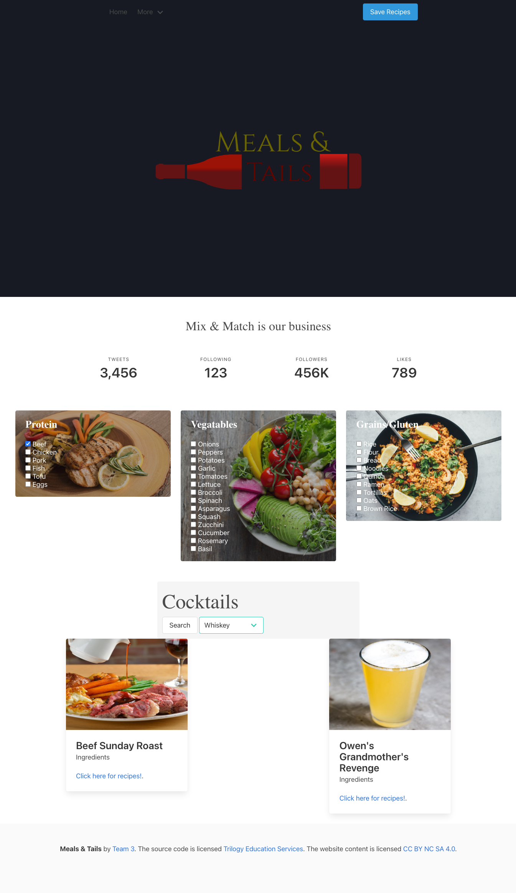

# Meals and Tails

## Contributors 
```
Kyle Grabski - HTML/Javascript

Mark Columbus - HTML

Noor Abdikadir - Styling

Manny Ybarra - HTML

Travis Watkins - HTML
```
# Take a look
Choose a few ingredients, select the type of cocktail you would like, and click search!

# Wireframe


# Flow Chart
User selects protein -> veggies -> grain -> diet <br>
Choose beverage type <br>
Click submit <br>
Takes us to recipes and beverage <br>
User has option to save recipes <br>


